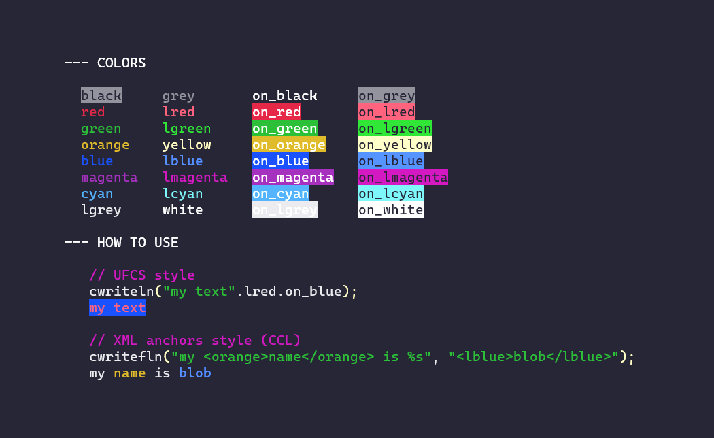

# console-colors

## Goals

`console-colors` is an attempt towards making the **ultimate zero-hassle console color library for D.**

It is meant as a spiritual successor of the `colorize` [package](https://github.com/yamadapc/d-colorize) and try to improve it based upon industrial usage of console colors in very important software.

As it is a very competitive field, we'll try to establish some claims using reasoning that this thing is better than some other related things.

## Example

```d
import std.stdio;
import consolecolors;

void main(string[] args)
{
    try
    {
        // do stuff that can throw
    }
    catch(CCLException e) // An exception with a coloured message
    {
        cwritefln("\n<lred>Error:</lred> %s", e.msg);
    }
    catch(Exception e) // An uncoloured exception.
    {
        cwritefln("\n<lred>Error:</lred> %s", escapeCCL(e.msg));
    }
}
```

## Cheat Sheet




## Features

- Use 16 different colors in the terminal, for foreground and background.

- Escape and un-escape from Console Colors Language (CCL), in order to mix and match coloured and uncoloured exceptions in your codebase.
  **Now you can `throw` with color information.**

- One file, can be copied in your project.

- Color information can be given in two ways:
   - Within text with easy-to-remember tags, such as `"my <blue> text is <red>coloured</red></blue>"`
     Syntax errors within this DSL called CCL throw, with error messages that are themselves coloured.
   - with string helper UFCS functions, such as `"my" ~ ("text is " ~ "coloured".red).blue`

- Portable with a special `cwrite[f][ln]` call, like the `colorize` package.
  Indeed, color information need to be **inline within text**, to properly nest in format strings.
  `console-colors` has a color stack to restore the previously set color.

- All colors have an easy shortcut like `.lmagenta` or `.white`, making it easier to add color in the first place (at the cost of your namespace).

- UTF-8 can be enabled on Windows, with `enableConsoleUTF8()`.

- Colors can be disabled globally, with `disableConsoleColors()`.
  It is an often wanted thing in command-line tools with colors.
  Colors are also disabled if `stdout` isn't a terminal, or if the terminal initialization failed.

We are heading towards the ultimate console in D. Reaching for the stars here.
You have no excuse anymore not to have colors in your terminal.

## Changelog

- **v1.3** Windows VT-100 detection, skips the emulation layer. New `enableConsoleUTF8()` call to set UTF-8 on Windows.

- **v1.2** stderr support with `stderr.cwritexxx("some CCL text");`

## Caveats

  - Any text that goes through `cwrite` must be CCL, so uncoloured input has to be escaped with `escapeCCL`. If you forget this, you will get a nice coloured `CCLException` that points out the issue.
  - `<` **MUST** be escaped with the entity `&lt;`
  - `>` **MUST** be escaped with the entity `&gt;`
  - `&` **MUST** be escaped with the entity `&amp;`

_If it's worth having a command-line, then it's worth having colours._
